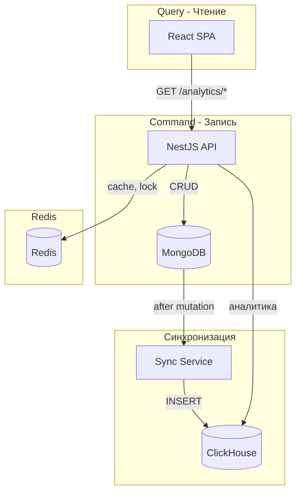

# PromoCode Manager

Fullstack приложение для управления промокодами с аналитикой. Реализует **CQRS-архитектуру**: запись в MongoDB, чтение аналитики из ClickHouse.

## Архитектура



### CQRS

- **MongoDB** — источник истины, все мутации (CRUD пользователей, промокодов, заказов, применение промокодов)
- **ClickHouse** — аналитика, все таблицы на фронтенде читают данные отсюда
- **Синхронизация** — sync-on-write с retry: после каждой мутации в MongoDB данные реплицируются в ClickHouse

### Таблицы ClickHouse

| Таблица | Содержимое |
|---------|------------|
| `users` | id, email, name, phone, isActive, createdAt |
| `promocodes` | id, code, discountPercent, totalLimit, perUserLimit, dateFrom, dateTo, isActive, createdAt |
| `orders` | id, userId, userEmail, userName, amount, promocodeId, promocodeCode, discountAmount, createdAt |
| `promo_usages` | id, orderId, promocodeId, promocodeCode, userId, userEmail, userName, discountAmount, usedAt |

Данные денормализованы — аналитика не обращается к MongoDB.

### Redis

- **Distributed lock** — при применении промокода (`lock:promocode:{id}`) для предотвращения race condition
- **Кэш** — результаты аналитических запросов (TTL 60s), инвалидация при мутациях

## Запуск

### 1. Инфраструктура (Docker Compose)

```bash
docker-compose up -d
```

Запускает MongoDB (27017), ClickHouse (8123), Redis (6379) с volumes и healthchecks.

### 2. Backend

```bash
cd backend
cp ../.env.example .env   # при необходимости отредактировать
npm install
npm run start:dev
```

API: http://localhost:3000

Таблицы ClickHouse создаются автоматически при старте приложения.

### 3. Frontend

```bash
cd frontend
npm install
npm run dev
```

Приложение: http://localhost:5173

**Важно:** Сначала запустите `docker-compose up -d`, затем backend, затем frontend.

### Переменные окружения

См. `.env.example`. Основные:

- `MONGODB_URI` — MongoDB
- `CLICKHOUSE_HOST`, `CLICKHOUSE_PORT`, `CLICKHOUSE_DATABASE`
- `REDIS_HOST`, `REDIS_PORT`
- `JWT_ACCESS_SECRET`, `JWT_REFRESH_SECRET`
- `VITE_API_URL` — URL API для фронтенда (по умолчанию http://localhost:3000)

## API

### Auth
- `POST /auth/register` — регистрация (email, password, name, phone)
- `POST /auth/login` — вход
- `POST /auth/refresh` — обновление токена

### Users
- `GET /users` — список

### Promocodes
- `GET /promocodes`, `POST /promocodes`, `PUT /promocodes/:id`, `DELETE /promocodes/:id`

### Orders
- `POST /orders` — создание заказа (amount)
- `GET /orders` — свои заказы
- `POST /orders/:id/apply-promocode` — применение промокода (body: `{ code: string }`)

### Analytics (из ClickHouse)
- `GET /analytics/users` — пользователи с агрегатами
- `GET /analytics/promocodes` — промокоды с метриками
- `GET /analytics/promo-usages` — история использований

Query-параметры: `page`, `pageSize`, `sortBy`, `sortOrder`, `dateFrom`, `dateTo`

## Server-side таблицы

Все аналитические таблицы используют:
- Server-side пагинацию (`page`, `pageSize`)
- Server-side сортировку (`sortBy`, `sortOrder`)
- Глобальный фильтр по датам с пресетами (Сегодня, 7 дней, 30 дней, Произвольный)

## Стек

- **Backend:** NestJS, TypeScript, Mongoose, @clickhouse/client, ioredis
- **Frontend:** React, Vite, TypeScript, TanStack Query, React Hook Form, Zod
- **БД:** MongoDB, ClickHouse, Redis
